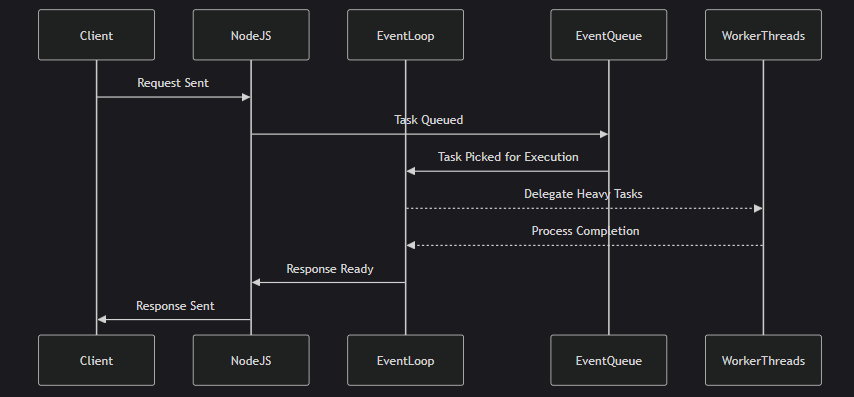

# How Node.js Works

## Must Watch video of Piyush Garg's explaination on how NodeJs works:

[Video Link for better understanding on NodeJs](https://youtu.be/y0aTs56DJWk?si=u5O0fIoGLrWPxDDK)

## Overview

Node.js operates on a **single-threaded, event-driven architecture**, which makes it lightweight and highly efficient. It is designed to handle multiple requests concurrently using **non-blocking I/O operations**.

## How Node.js Works

1. **Client Request:** When a client makes a request (e.g., accessing a webpage, API call, database query), it is sent to the Node.js server.
2. **Event Loop:** Node.js processes requests using an event loop, which efficiently manages asynchronous tasks without blocking execution.
3. **Worker Threads & Thread Pool:** For complex operations like file handling and database queries, Node.js uses worker threads in the background.
4. **Callback & Event Emitter:** Once the task is completed, a callback function executes to return the result to the client.
5. **Response Sent:** The processed response is sent back to the client.

## Synchronous vs Asynchronous Tasks in Node.js

### **Synchronous Tasks**
- Executed sequentially, one after another.
- Blocks the execution of further code until the current task completes.
- Example:
  ```javascript
  console.log("Start");
  for (let i = 0; i < 5; i++) {
    console.log(i);
  }
  console.log("End");
  ```
  
### **Asynchronous Tasks**
- Executed independently without blocking the main thread.
- Uses callbacks, promises, or async/await for handling operations.
- Example:
  ```javascript
  console.log("Start");
  setTimeout(() => {
    console.log("Async Task Executed");
  }, 2000);
  console.log("End");
  ```

## Node.js Execution Flow



## Key Components

### 1. **V8 Engine**
- Converts JavaScript code into machine code for fast execution.

### 2. **Libuv**
- Handles asynchronous operations using the event loop and thread pool.

### 3. **Event Loop**
- Continuously checks and processes tasks asynchronously.

### 4. **Event Queue**
- Stores asynchronous operations and delivers them to the event loop when ready.

### 5. **Non-Blocking I/O**
- Allows handling multiple requests simultaneously without waiting for previous ones to complete.

## Why is Node.js Efficient?

- **Asynchronous Processing**: Tasks are executed in parallel without waiting.
- **Event-Driven Model**: Ensures smooth execution with minimal overhead.
- **Single-Threaded but Scalable**: Manages multiple connections using a single thread efficiently.

Understanding these concepts makes it easier to develop scalable and high-performance applications using Node.js!
